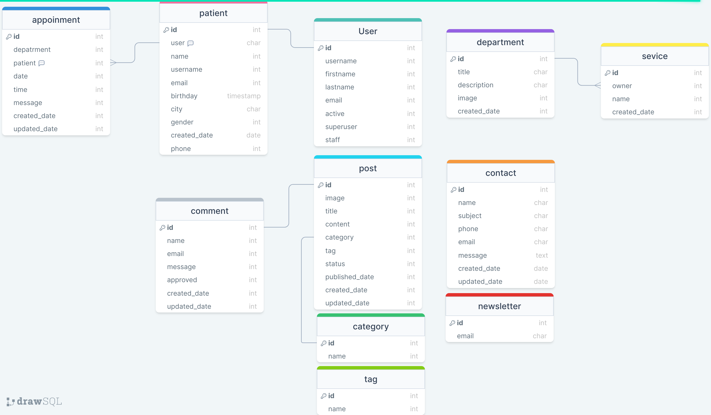
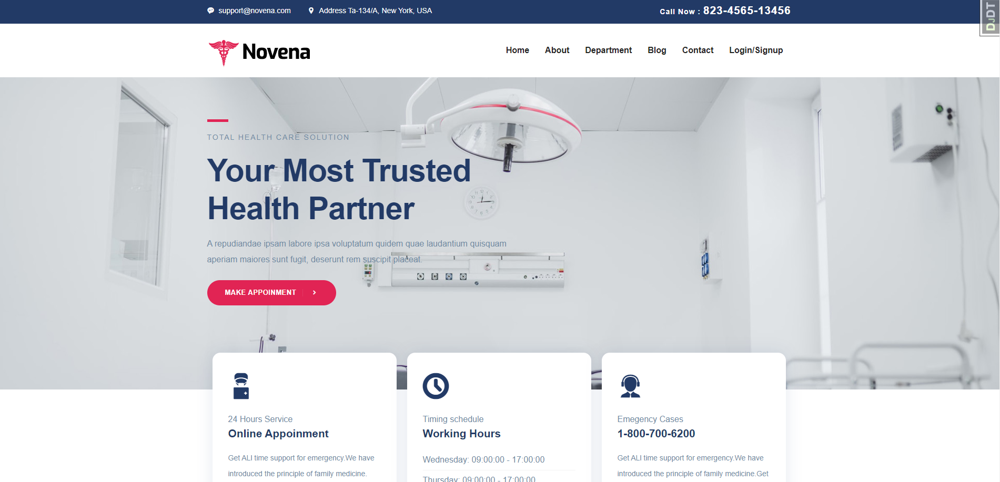
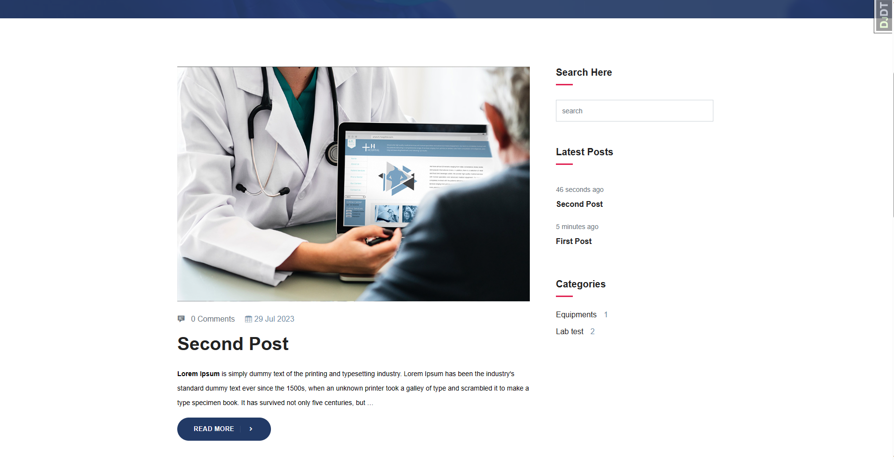

# HealthCare
A healthcare web application to facilitate appointment scheduling and management for patients. The application can allow users to make appointments and an email notification will sent to them to confirm the appointment.  The web application has a blog section that provides health-related information and tips to users.
## Features

- Patient Profile
- Make Appointment
- Blog

## Instalation

> 1. clone repo https://github.com/ali-abbaszade/HealthCare.git
> 2. create virtual enviroment and activate
>    - python -m venv venv
>    - venv\Scripts\activate (Windows)
>    - source venv/bin/activate (Linux & Mac)
> 3. cd into project
> 4. pip install -r requirements.txt

## Run Project

deployment settings
`python manage.py runserver 0.0.0.0:8000 --settings=mysite.setting.dev`

production settings
`python manage.py runserver 0.0.0.0:8000 --settings=mysite.setting.prod`

## Model Schema

## Home Page

## Blog Page

